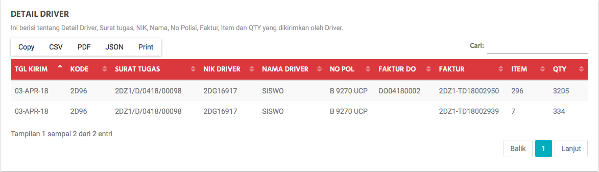

Cek Driver Barang
=================

Untuk mengantisipasi akan terjadi nya cek driver barang pada **SOA** (Store Online Aplication) ketika koneksi tidak bagus, menu ini akhirnya terbuat. Dalam menu ini anda bisa melihat beberapa Detail pengiriman barang dan Detail driver pengantar barang. 

.. figure:: img/bantuan/cek_driver_barang.png
    :align: center

    Cek Driver Barang Alfa Xpired

Detail Barang
-------------

Data pada Detail Barang ini akan terbentuk jika file EOD yang dikirimkan dari toko dan sudah terproses di Office yang akan terbentuk PB (Permintaan Barang) dari Toko ke Office.

.. figure:: img/bantuan/cek_driver_barang_barang.png
    :align: center

    Detail Barang Alfa Xpired
	
	

.. list-table:: 
   :widths: 20 80
   :header-rows: 1

   * - Nama Kolom
     - Keterangan
   * - ``TGL``
     - Tanggal barang tersebut diproses dan akan dikirimkan ke toko.
   * - ``KODE``
     - Kode Toko
   * - ``NAMA_TOKO``
     - Nama Toko
   * - ``QTY PICK``
     - Banyaknya barang yang di Picking.
   * - ``RUPIAH PICK``
     - Total Rupiah Picking
   * - ``QTY SHIP``
     - Banyaknya barang yang di Shipping
   * - ``RUPIAH SHIP``
     - Total Rupiah Shipping

Detail Driver
-------------

Data pada Detail Driver ini akan terbentuk jika barang sudah selesai proses **Picking** dan **Shipping**.

    Detail Driver Alfa Xpired

.. list-table:: 
   :widths: 20 80
   :header-rows: 1

   * - Nama Kolom
     - Keterangan
   * - ``TGL``
     - Tanggal barang tersebut diproses dan akan dikirimkan ke toko.
   * - ``KODE``
     - Kode Toko
   * - ``SURAT TUGAS``
     - Surat jalan Driver.
   * - ``NIK DRIVER``
     - Nik Driver
   * - ``NAMA DRIVER``
     - Nama Driver
   * - ``NO POL``
     - Nomor Polisi Kendaraan Driver
   * - ``FAKTUR DO``
     - Faktur yang terbentuk melalui proses Picking
   * - ``FAKTUR``
     - No faktur yang terbentuk oleh D.C.
   * - ``ITEM``
     - Banyaknya ITEM
   * - ``QTY``
     - Banyaknya QTY
     

