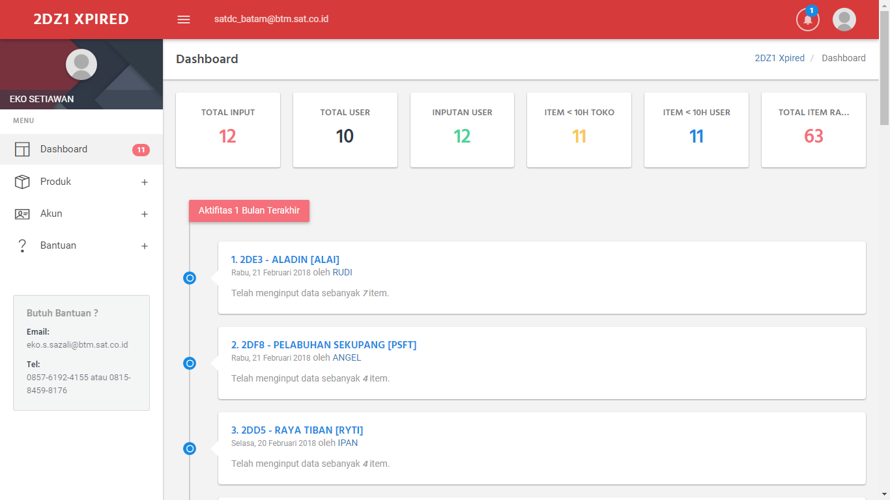
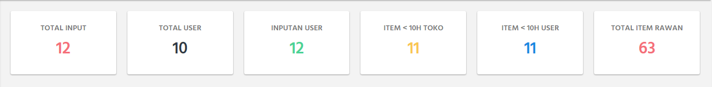
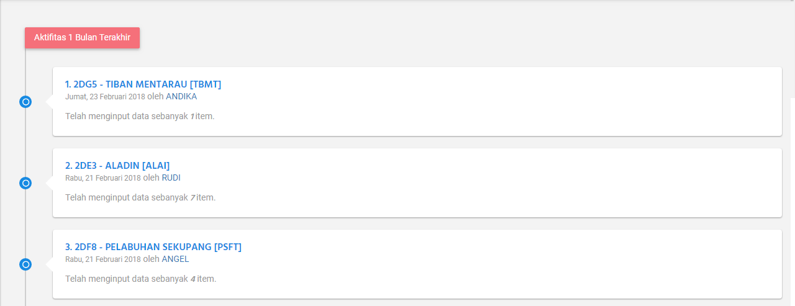

Dashboard
=========

Ketika sudah sukses memasukkan :guilabel:`NIK` dan :guilabel:`PASSWORD`, Otomatis akan dialihkan ke halaman `DASHBOARD`.

    Halaman Dashboard Alfa Xpired

Widget
------	

Ketika sudah login akan melihat tampilan ``Widget``, ini berfungsi melihat beberapa informasi yang perlu kita ketahui.

    Widget Alfa Xpired
	
	

.. list-table:: 
   :widths: 20 80
   :header-rows: 1

   * - Nama Widget
     - Keterangan
   * - ``TOTAL INPUT``
     - Total inputan semua user yang berada di toko
   * - ``TOTAL USER``
     - Total user yang sudah mendaftar akun **Alfa Xpired** di toko 
   * - ``INPUTAN USER``
     - Total user menginput data expired 
   * - ``ITEM < 10H TOKO``
     - Total semua item di toko yang sudah mendekati 10 hari RH 
   * - ``ITEM < 10H USER``
     - Total semua item user yang sudah mendekati 10 hari RH 
   * - ``TOTAL ITEM RAWAN``
     - Total banyaknya PLU rawan yang sudah ditentukan yang berada di toko 
	 

Aktifitas 1 Bulan
-----------------
	
Ini adalah aktifitas penginputan yang dilakukan oleh semua toko yang ada di branch, kapan diinput, berapa banyak item yang diinput bisa dilihat disini. Aktifitas ini dalam periode ``< 30 Hari``.

    Aktifitas 1 bulan terakhir Alfa Xpired