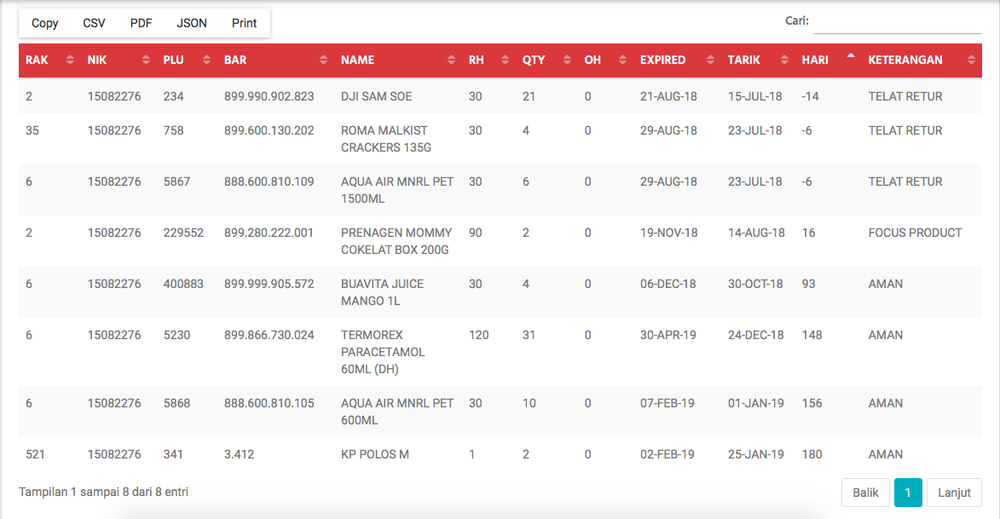

Lihat
=====

Di **Alfa Xpired** setelah kita menginput, data yang telah kita input bisa dilihat disini di menu **Produk**->**Lihat**. Dihalaman **Lihat** ada beberapa kolom yg berisi informasi tentang barang yang sudah kita input agar memudahkan kita dalam memonitoring, contoh seperti ini :

    Lihat

Penjelasan kolom **Lihat** sebagai berikut : 
	

.. list-table:: 
   :widths: 20 80
   :header-rows: 1

   * - Nama Kolom
     - Keterangan
   * - ``RAK``
     - No Rak item tersebut yang sudah kita input
   * - ``NIK``
     - NIK Karyawan yang menginput barang tersebut
   * - ``PLU``
     - PLU barang yang akan diinput
   * - ``BARCODE``
     - Barcode yang tertera pada kemasan item
   * - ``NAMA BARANG``
     - Nama barang tersebut
   * - ``RH``
     - Retur Hari, yaitu batas maksimal retur dari Toko ke Warehouse
   * - ``QTY``
     - Banyaknya barang tersebut
   * - ``OH``
     - On Hand barang tersebut yang berada ditoko. (Data On Hand H-1)
   * - ``EXPIRED``
     - Tanggal Expired yang tertera pada kemasan / item
   * - ``TARIK``
     - Batas maksimal kita menarik item tersebut dari area sales untuk di retur
   * - ``HARI``
     - Sisa (dalam satuan hari) masa barang tersebut harus ditarik
   * - ``KETERANGAN``
     - Status barang tersebut, apakah telat retur atau masih bisa retur dll.

