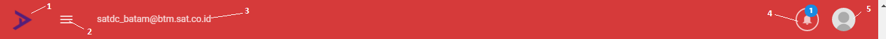
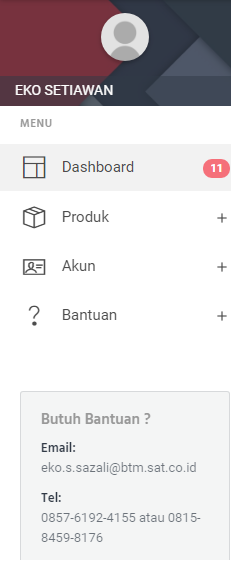
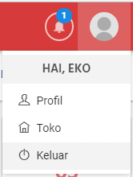

Tampilan
========

Disini kita dapat melihat ada beberapa tampilan yang terbagi dari 

1. Header
2. Sidebar
3. Dropdown

.. figure:: img/dashboard-1.png
    :align: center

    Halaman Dashboard 

1. Header
---------	

    Tampilan Header 
	
.. list-table:: 
   :widths: 5 40
   :header-rows: 1

   * - No
     - Keterangan
   * - ``1``
     - Logo aplikasi
   * - ``2``
     - Tombol untuk memunculkan atau menghilangkan menu sidebar
   * - ``3``
     - Alamat Email toko 
   * - ``4``
     - Notifikasi jika ada barang yang harus diretur, dan telat retur 
   * - ``5``
     - Menu Dropdown user
	 
	 
2. Sidebar
----------	

    Tampilan Sidebar 
	
.. list-table:: 
   :widths: 5 40
   :header-rows: 1

   * - No
     - Keterangan
   * - ``Dashboard``
     - Halaman beranda yang berisi aktifitas inputan dari seluruh toko di branch
   * - ``Produk``
     - Untuk menginput barang, melihat, menghapus dapat menggunakan menu ini
   * - ``Akun``
     - Untuk mendaftarkan akun, dan reset password. (``Menu ini muncul hanya untuk pejabat toko``) 
   * - ``Bantuan``
     - Menu yang berfungsi melihat detail pengiriman barang, list item rawan, dan panduan pengguna
	 
	 
3. Dropdown
-----------	

    Tampilan Dropdown 
	
.. list-table:: 
   :widths: 5 40
   :header-rows: 1

   * - No
     - Keterangan
   * - ``Profil``
     - Untuk melihat informasi profil, dan untuk mereset ulang kata sandi
   * - ``Toko``
     - Untuk melihat detail toko, dan melihat user yang sudah mendaftar akun **Alfa Xpired**
   * - ``Keluar``
     - Untuk keluar dari **Alfa Xpired**